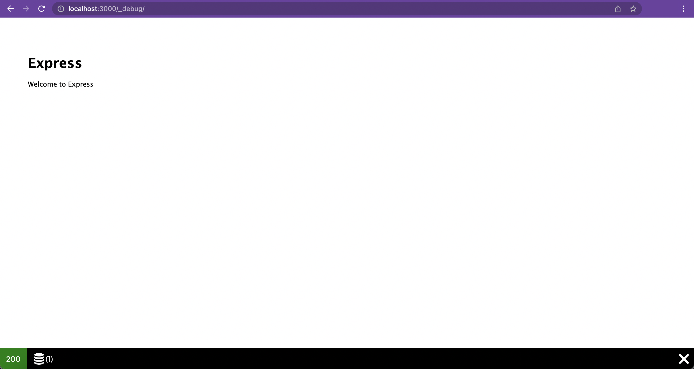
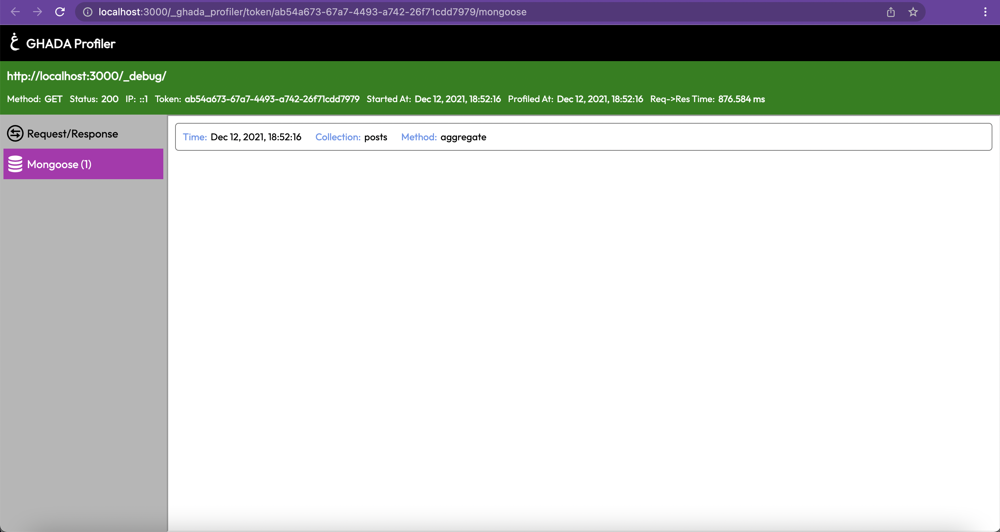

# Ghada Express Profiler Mongoose Scope

Mongoose scope for Ghada Express Profiler

## Works with

- `@ghadautopia/express-profiler` version `1`

## Dependencies

```package.json
"@ghadautopia/express-profiler": "^1.0.0",
"ejs": "^3.1.6",
"on-finished": "^2.3.0"
```

## Installation

Using npm

```sh
npm install @ghadautopia/express-profiler-mongoose
```

Or using yarn

```sh
yarn add @ghadautopia/express-profiler-mongoose
```

## Usage

Import `mongooseScope` and `mongooseStreamMiddleware` from `@ghadautopia/express-profiler-mongoose` and add them to Ghada Express Profiler configuration. As shown in the example below:

```node
// import mongoose
const mongoose = require('mongoose');
// import mongooseScope instance and mongooseStreamMiddleware
const { mongooseScope, mongooseStreamMiddleware } = require('@ghadautopia/express-profiler-mongoose');

/**
 * during profiler inistantiation,
 * pass mongooseScope in the scopes array, 
 * pass mongooseStreamMiddleware in streamMiddlewares array and pass your mongoose instance to it
 */
profiler(app, {
  scopes: [
    ...  
    mongooseScope,
    ...
  ],
  streamMiddlewares: [
    ...
    mongooseStreamMiddleware(mongoose)
    ...
  ],
});
```

## How it works

`mongooseStreamMiddleware` is used by mongoose scope stream to log data of each mongoose query/command

`mongooseScope` is used for rendering mongoose slot in the toolbar and the mongoose scope view





## License

MIT
